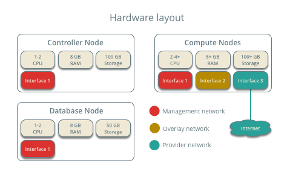
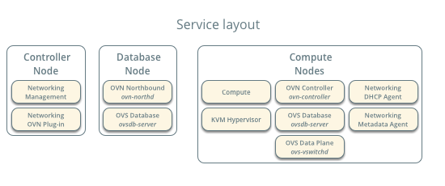
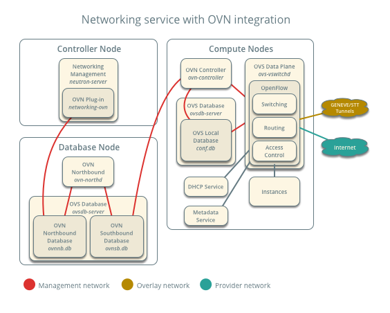

======================
Reference architecture
======================

The reference architecture defines the minimum environment necessary
for a basic evaluation of OpenStack with Open Virtual Network (OVN)
integration for the Networking service. You can deploy this environment
manually using the :ref:`Installation Guide <installation>` or using
`Vagrant <https://github.com/openstack/networking-ovn/tree/master/vagrant>`_.
Any scaling or performance evaluations should use bare metal instead of
virtual machines.

Layout
------

The minimum environment includes four nodes.

The controller node contains the following components that provide enough
functionality to launch basic instances:

* One network interface for management
* Identity service
* Image service
* Compute management (control plane)
* Networking management with OVN ML2 driver (control plane)

The database node contains the following components:

* One network interface for management
* OVN northbound service (``ovn-northd``)
* Open vSwitch (OVS) database service (``ovsdb-server``) with OVN northbound
  (``ovnnb.db``) and southbound (``ovnsb.db``) databases

The compute nodes contain the following components:

* Three network interfaces for management, overlay networks, and provider
  networks
* Compute management (hypervisor)
* Hypervisor (KVM)
* OVN controller service (``ovn-controller``)
* OVS data plane service (``ovs-vswitchd``)
* OVS database service (``ovsdb-server``) with OVS local configuration
  (``conf.db``) database
* Networking DHCP agent
* Networking metadata agent

.. note::

   By default, deploying DHCP and metadata agents on two compute nodes
   provides basic redundancy for these services. For larger environments,
   consider deploying the agents on a fraction of the compute nodes to
   minimize control plane traffic.

Networking service with OVN integration
---------------------------------------

The reference architecture deploys the Networking service with OVN
integration as follows:

Each compute node contains the following network components:

.. image:: figures/ovn-compute1.png
   :alt: Compute node network components
   :align: center

.. note::

   The Networking service creates a unique network namespace for each
   virtual subnet that enables the DHCP service.
